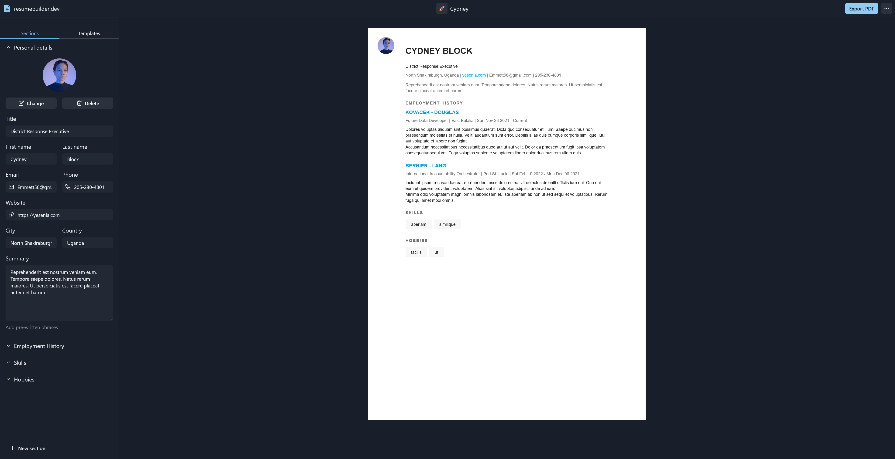

# [resumebuilder.dev](https://www.resumebuilder.dev)

[](https://github.com/facebook/jest)
[](https://cypress.io)
[](https://github.com/prettier/prettier)
[](https://github.com/malcodeman/resumebuilder.dev/blob/master/LICENSE)

Resume builder for developers.



## Getting started

```
git clone https://github.com/malcodeman/resumebuilder.dev.git resumebuilder.dev
cd resumebuilder.dev
yarn install && yarn dev
```

## License

[MIT](./LICENSE)
